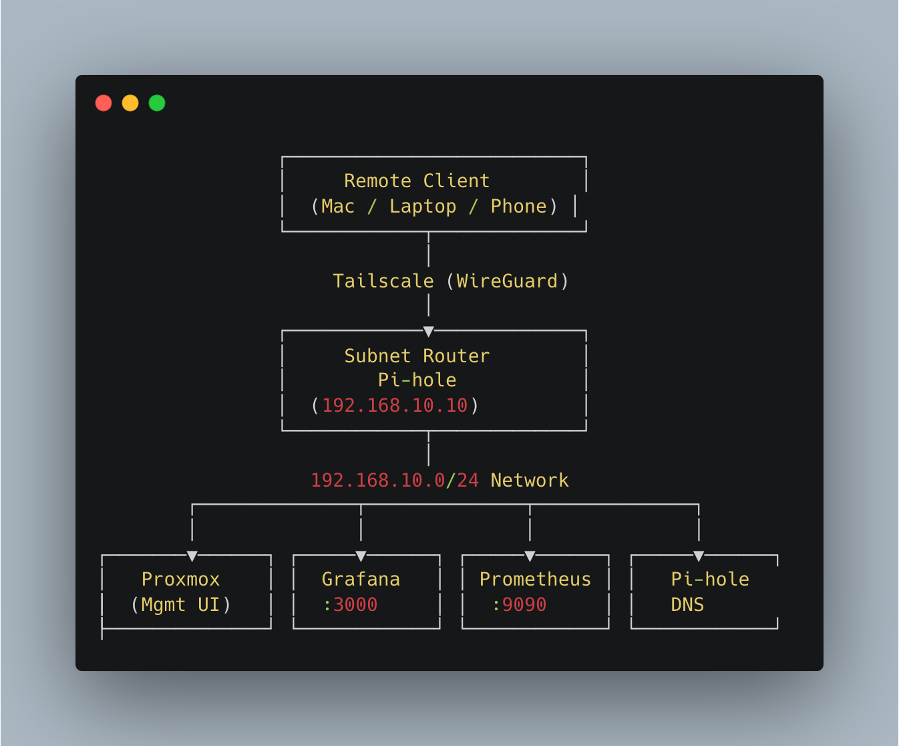
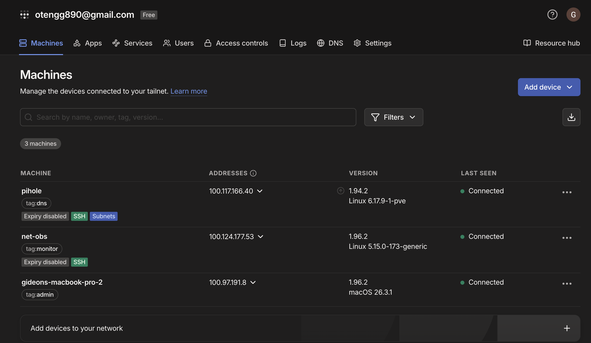
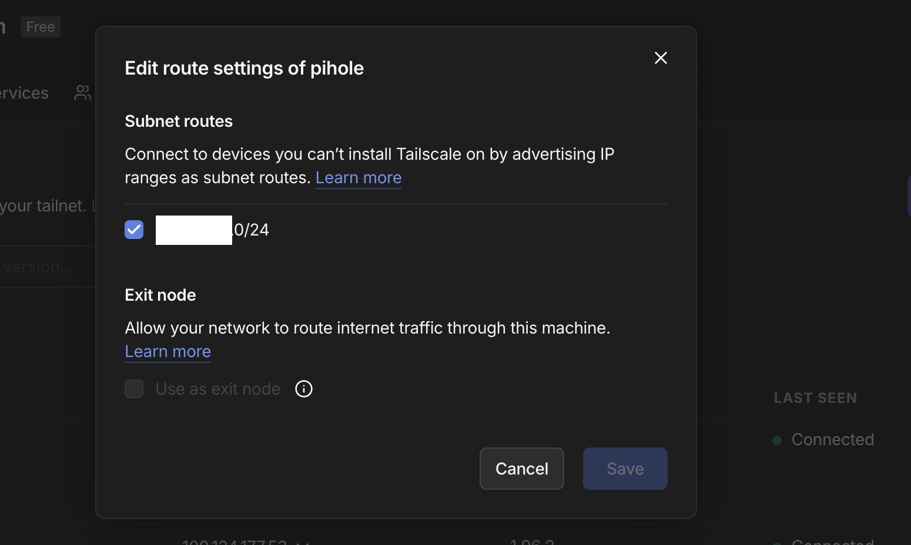
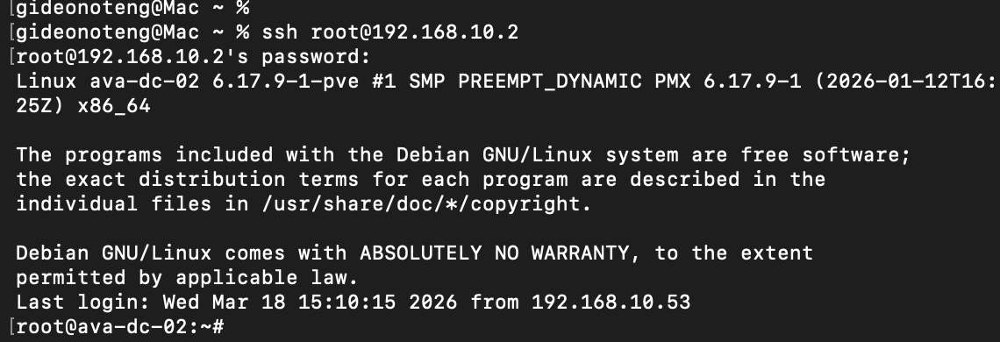
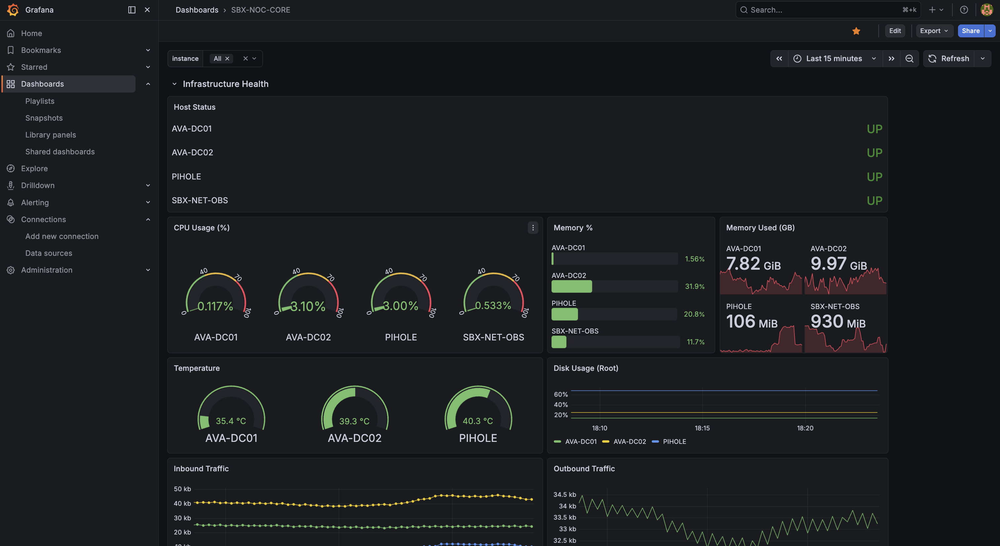
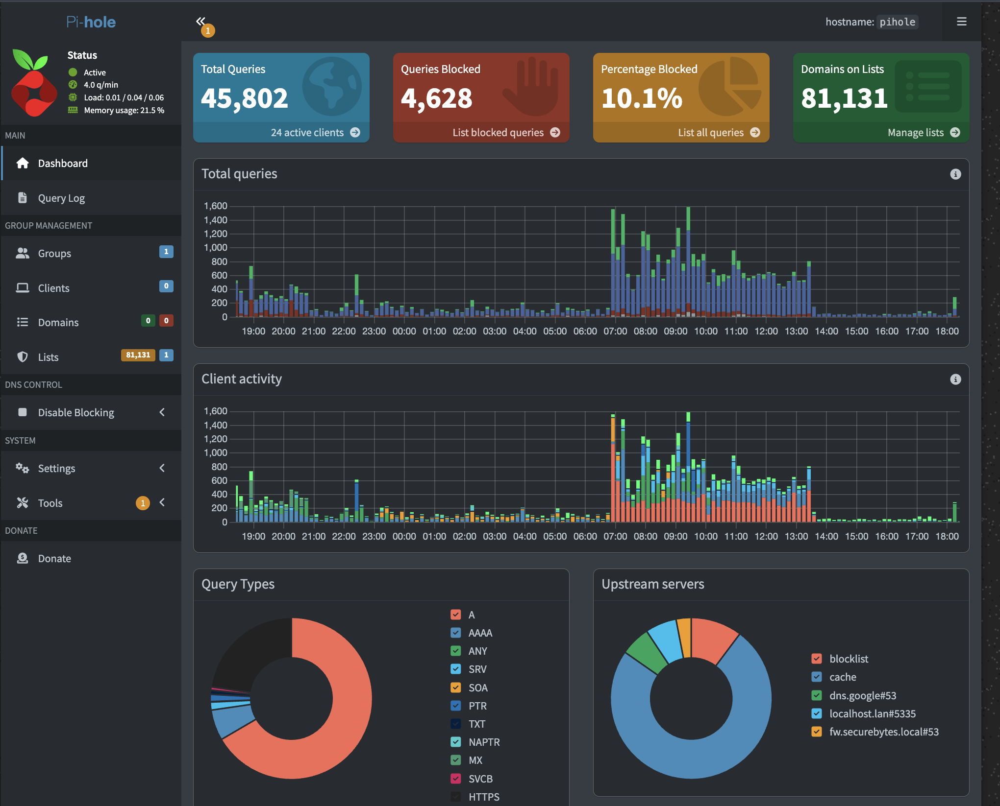

# SecureBytes — Zero Trust Lab

Identity-based remote access to private infrastructure using Tailscale.
No public exposure. No legacy VPN. No implicit trust.


---

## Problem Statement

Traditional VPN access requires open inbound ports, static credentials, and implicit trust once inside the network perimeter. This creates unnecessary attack surface for a private lab environment that requires secure remote access from untrusted networks.

## Solution

A WireGuard-based overlay network (Tailscale) provides identity-verified, policy-enforced access to internal services — with zero public exposure and no changes to the upstream network.

---

## Architecture
```
Remote Client
      │
      │  WireGuard / Tailscale overlay
      ▼
Identity Verification + ACL Evaluation
      │
      ▼
Subnet Router  ·  192.168.10.5
      │
      │  NAT + route advertisement
      ▼
Internal Services  ·  192.168.10.0/24
```



---

## Access Control

Policy is deny-by-default. All access is explicit and tag-scoped.

| Tag | Grants Access To |
|---|---|
| `tag:admin` | Full subnet — all hosts, all ports |
| `tag:dns` | Pi-hole DNS — port 53 only |
| `tag:monitor` | Grafana · Prometheus · Alertmanager |

Full policy: [`acl.json`](acl.json)

---

## Implementation

- Tailscale deployed on all client and lab nodes
- Pi-hole configured as subnet router with IP forwarding and NAT
- Tag-based ACLs applied and validated against all three access tiers
- Remote access verified from external networks

---

## Operational Notes

| Condition | Behavior |
|---|---|
| Node reboot | Tailscale auth persists — no re-auth required |
| Node reimage | Re-auth required — reapply tags and route flags |
| Route missing on client | Run `tailscale up --accept-routes` |
| Tag drift after re-auth | ACL silently blocks — reapply tags immediately |
| NAT not applied | Return traffic drops — MASQUERADE rule required on LAN interface |

---

## Key Design Decisions

**No inbound ports.** The edge firewall has no open ports. All access initiates outbound from the client through the Tailscale coordination server — the internal network is never directly reachable from the internet.

**Subnet routing over exit node.** Only traffic destined for `192.168.10.0/24` traverses the overlay. This reduces latency and limits the blast radius of a compromised node.

**Pi-hole as subnet router.** Centralizes DNS filtering and subnet advertisement on a single lightweight node. All enrolled clients resolve DNS through Pi-hole regardless of physical location.

**Tag-based segmentation over firewall rules.** Access policy lives in the Tailscale ACL — not iptables rules spread across individual hosts. Policy changes take effect instantly across all nodes without touching host-level config.

---

## Capabilities

- Remote SSH to internal hosts from any network
- Secure access to Grafana and Prometheus dashboards
- Network-wide DNS filtering via Pi-hole
- Identity-based segmentation — no shared credentials, no IP allowlists

---

## Roadmap

- [ ] Private service publishing via `securebytes.net`
- [ ] Reverse proxy with TLS termination (Caddy)
- [ ] SSO integration via Entra ID
- [ ] Multi-site subnet routing

---

## Visual Proof

<details>
<summary>Tailscale node overview</summary>



</details>

<details>
<summary>Subnet routing configuration</summary>



</details>

<details>
<summary>Remote SSH access</summary>



</details>

<details>
<summary>Grafana dashboard</summary>



</details>

<details>
<summary>Pi-hole DNS layer</summary>



</details>

---

**Gideon Oteng** · [github.com/otengg](https://github.com/otengg)
